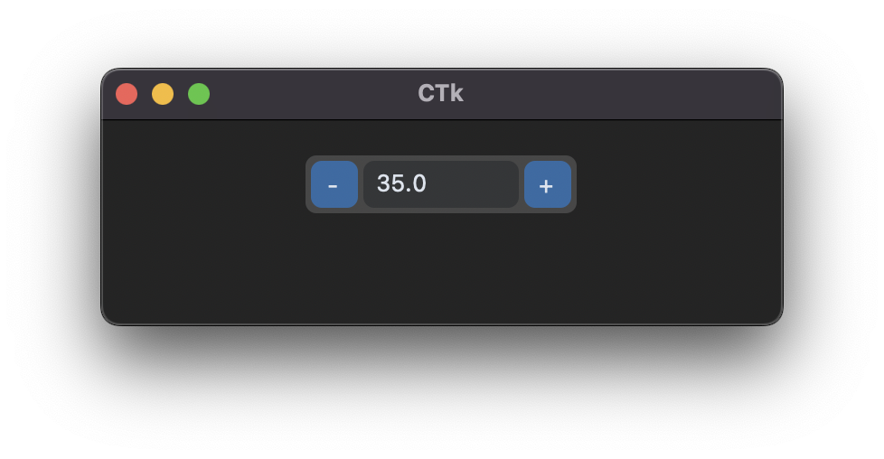

# Create Spinbox

Como criar widgets customizados baseados em frames.

## Estrutura base

```python
import customtkinter

class WidgetName(customtkinter.CTkFrame):
    def __init__(self, *args,
                 width: int = 100,
                 height: int = 32,
                 step_size: int | float = 1,
                 command = None,
                 **kwargs):
        super().__init__(*args, width=width, height=height, **kwargs)

        self.step_size = step_size
        self.command = command

        self.configure(fg_color=("gray78", "gray28"))

        self.grid_columnconfigure((0, 2), weight=0)
        self.grid_columnconfigure(1, weight=1)

        self.subtract_button = customtkinter.CTkButton(self, text="-", width=height-6, height=height-6,
                                                       command=self.subtract_button_callback)
        self.subtract_button.grid(row=0, column=0, padx=(3, 0), pady=3)

        self.entry = customtkinter.CTkEntry(self, width=width-(2*height), height=height-6, border_width=0)
        self.entry.grid(row=0, column=1, padx=3, pady=3, sticky="ew")

        self.add_button = customtkinter.CTkButton(self, text="+", width=height-6, height=height-6,
                                                  command=self.add_button_callback)
        self.add_button.grid(row=0, column=2, padx=(0, 3), pady=3)

        self.entry.insert(0, "0.0")

    def add_button_callback(self):
        if self.command is not None:
            self.command()
        try:
            value = float(self.entry.get()) + self.step_size
            self.entry.delete(0, "end")
            self.entry.insert(0, value)
        except ValueError:
            return

    def subtract_button_callback(self):
        if self.command is not None:
            self.command()
        try:
            value = float(self.entry.get()) - self.step_size
            self.entry.delete(0, "end")
            self.entry.insert(0, value)
        except ValueError:
            return

    def get(self) -> int | float | None:
        try:
            return float(self.entry.get())
        except ValueError:
            return None

    def set(self, value: int | float):
        self.entry.delete(0, "end")
        self.entry.insert(0, str(float(value)))
```

> Você pode adicionar métodos `.configure()` específicos para expor cores e tamanhos.

## Usando a spinbox

```python
import customtkinter

app = customtkinter.CTk()

spinbox = FloatSpinbox(app, width=150, step_size=3)
spinbox.pack(padx=20, pady=20)

spinbox.set(35)
print(spinbox.get())

app.mainloop()
```


