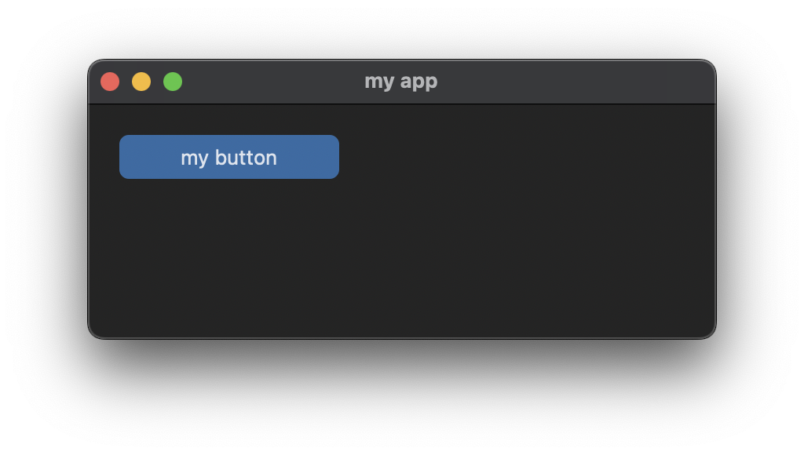
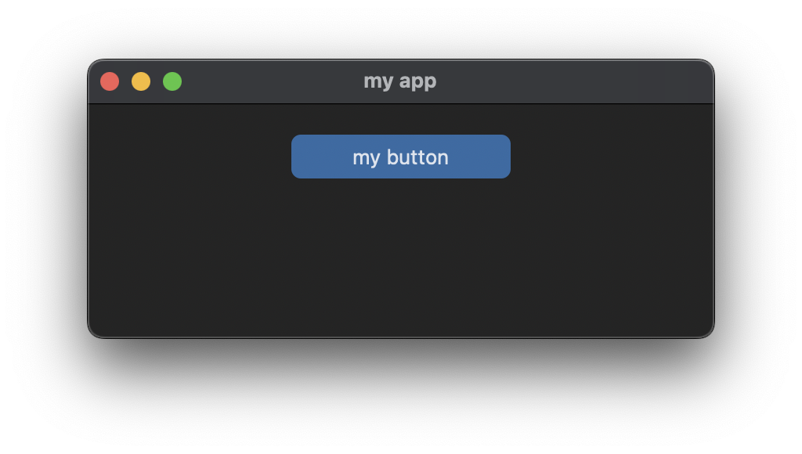
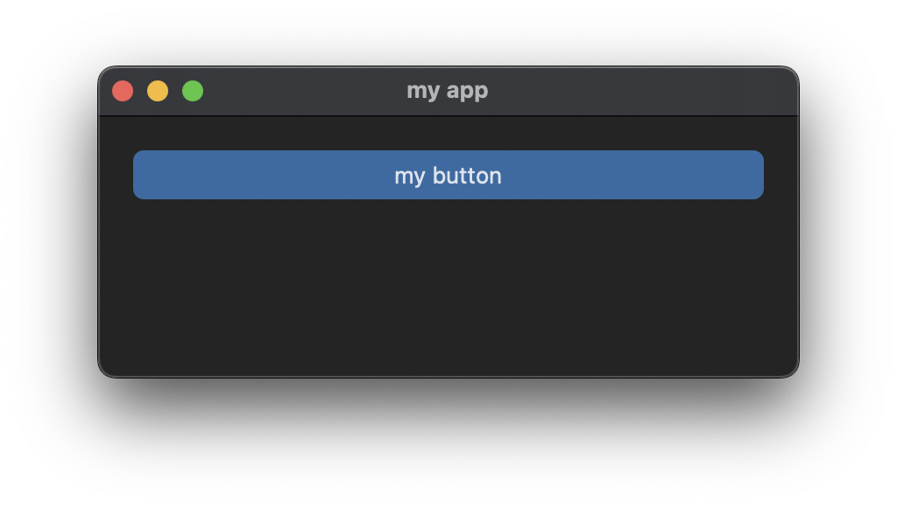
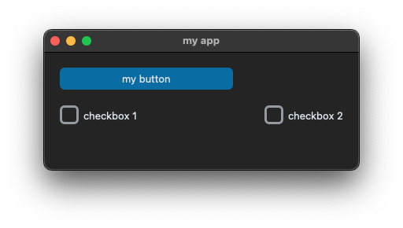
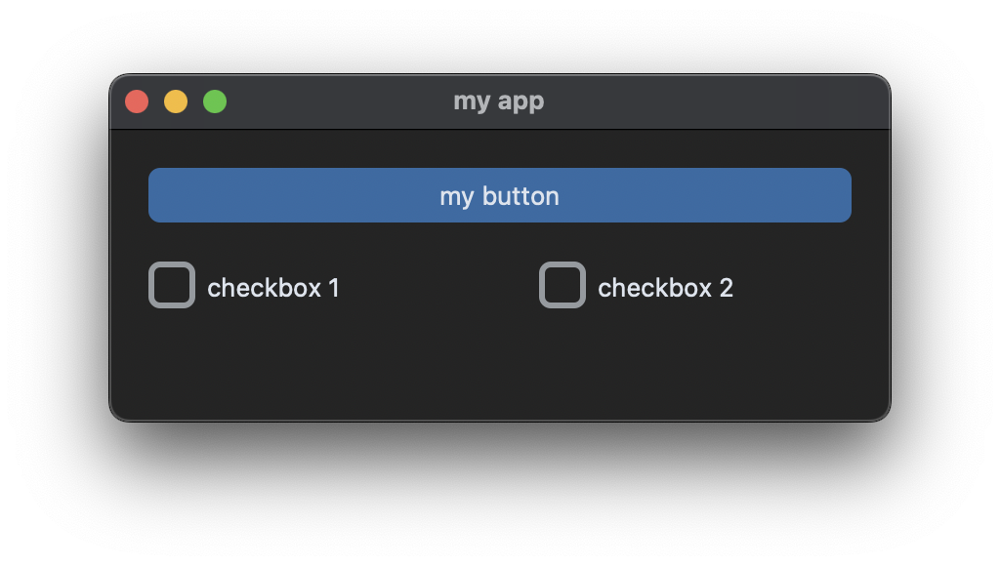

# Grid System

## App básico

Primeiro, confira se o CustomTkinter está instalado:

```bash
pip install customtkinter
```

Teste a instalação com o programa mínimo:

```python
import customtkinter

app = customtkinter.CTk()
app.mainloop()
```

Defina título e geometria, e adicione um botão:

```python
import customtkinter

def button_callback():
    print("button pressed")

app = customtkinter.CTk()
app.title("my app")
app.geometry("400x150")

button = customtkinter.CTkButton(app, text="my button", command=button_callback)
button.grid(row=0, column=0, padx=20, pady=20)

app.mainloop()
```

> O primeiro parâmetro de todo widget é sempre o `master` (ex.: `app`). Ele também pode ser passado como keyword: `CTkButton(master=app, ...)`.



## Grid geometry manager

O gerenciador de geometria `grid` posiciona e aplica padding nos widgets. É recomendado usar `grid` ao invés de `place` ou `pack` para criar interfaces responsivas.

O `grid` divide janelas ou frames em linhas e colunas, que colapsam quando vazias, mas se adaptam ao tamanho dos widgets. Para centralizar o botão do exemplo acima, atribua peso à primeira coluna:

```python
app.grid_columnconfigure(0, weight=1)
```



Agora a coluna 0 ocupa toda a janela. Para fazer o botão expandir junto com a célula, use `sticky`:

```python
button.grid(row=0, column=0, padx=20, pady=20, sticky="ew")
```



O tamanho do botão se adapta se você redimensionar a janela.

## Adicionar checkboxes

Adicione duas checkboxes na segunda linha:

```python
checkbox_1 = customtkinter.CTkCheckBox(app, text="checkbox 1")
checkbox_1.grid(row=1, column=0, padx=20, pady=(0, 20), sticky="w")

checkbox_2 = customtkinter.CTkCheckBox(app, text="checkbox 2")
checkbox_2.grid(row=1, column=1, padx=20, pady=(0, 20), sticky="w")
```



Observe:
- `pady` como tupla aplica `0` no topo e `20` na base.
- As checkboxes ficam alinhadas a `w` (oeste).
- Para o botão ocupar a janela novamente, use `columnspan=2`:

```python
button.grid(row=0, column=0, padx=20, pady=20, sticky="ew", columnspan=2)
```

Distribua igualmente as colunas:

```python
app.grid_columnconfigure((0, 1), weight=1)
```

```python
import customtkinter

def button_callback():
    print("button pressed")

app = customtkinter.CTk()
app.title("my app")
app.geometry("400x150")
app.grid_columnconfigure((0, 1), weight=1)

button = customtkinter.CTkButton(app, text="my button", command=button_callback)
button.grid(row=0, column=0, padx=20, pady=20, sticky="ew", columnspan=2)

checkbox_1 = customtkinter.CTkCheckBox(app, text="checkbox 1")
checkbox_1.grid(row=1, column=0, padx=20, pady=(0, 20), sticky="w")

checkbox_2 = customtkinter.CTkCheckBox(app, text="checkbox 2")
checkbox_2.grid(row=1, column=1, padx=20, pady=(0, 20), sticky="w")

app.mainloop()
```



## Usando classes

Organize o programa em classes para aumentar legibilidade e manutenibilidade:

```python
import customtkinter

class App(customtkinter.CTk):
    def __init__(self):
        super().__init__()

        self.title("my app")
        self.geometry("400x150")
        self.grid_columnconfigure((0, 1), weight=1)

        self.button = customtkinter.CTkButton(self, text="my button", command=self.button_callback)
        self.button.grid(row=0, column=0, padx=20, pady=20, sticky="ew", columnspan=2)

        self.checkbox_1 = customtkinter.CTkCheckBox(self, text="checkbox 1")
        self.checkbox_1.grid(row=1, column=0, padx=20, pady=(0, 20), sticky="w")

        self.checkbox_2 = customtkinter.CTkCheckBox(self, text="checkbox 2")
        self.checkbox_2.grid(row=1, column=1, padx=20, pady=(0, 20), sticky="w")

    def button_callback(self):
        print("button pressed")

app = App()
app.mainloop()
```

> Use classes para `CTk`, `CTkToplevel` e `CTkFrame` a menos que seja um programa muito pequeno ou teste.
