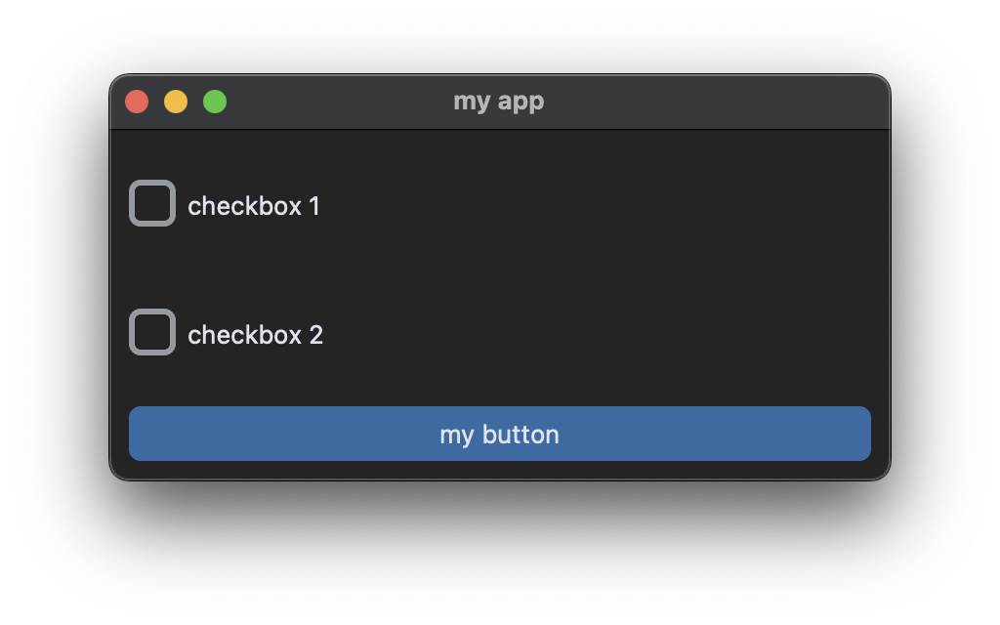
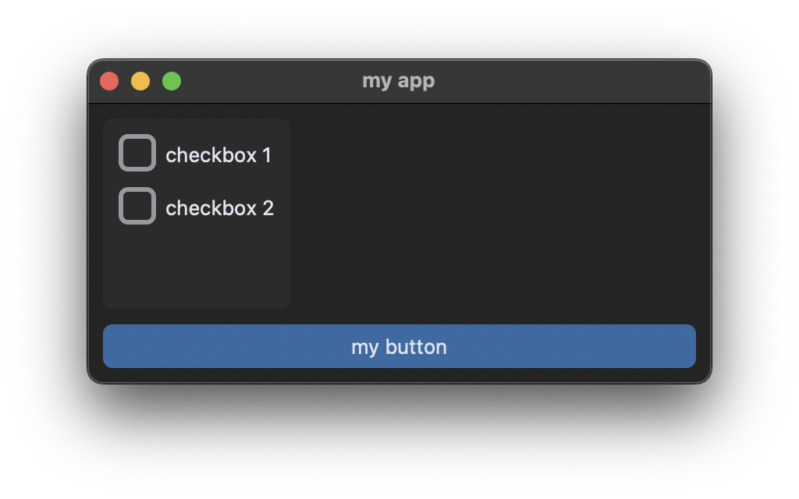
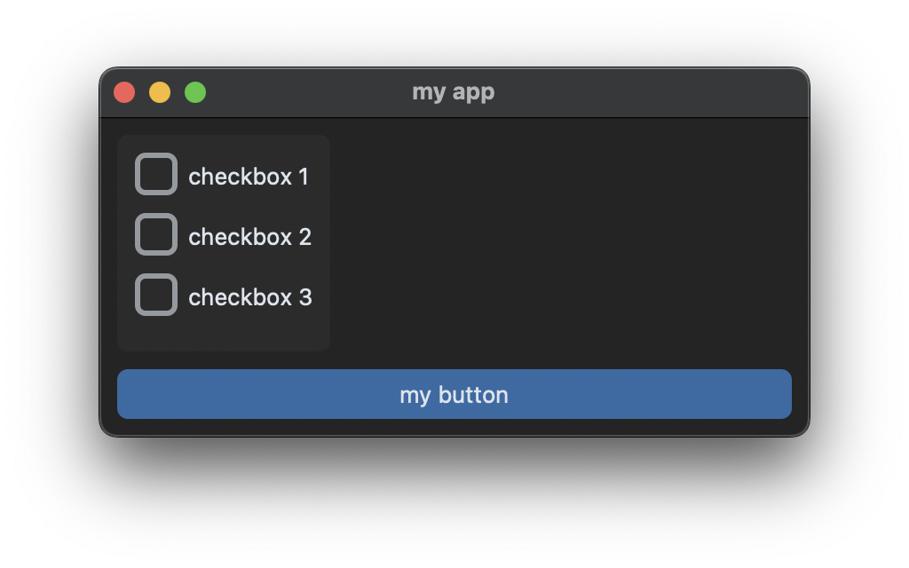
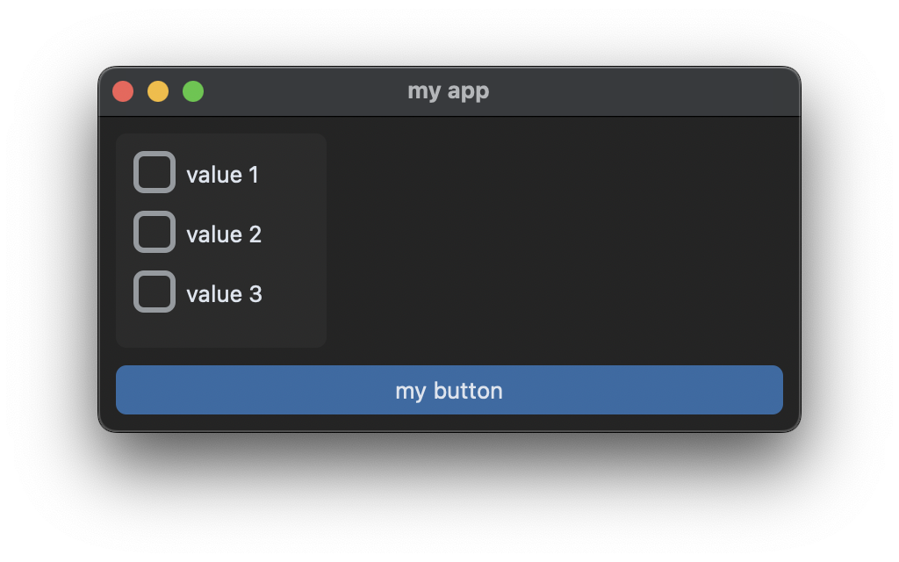
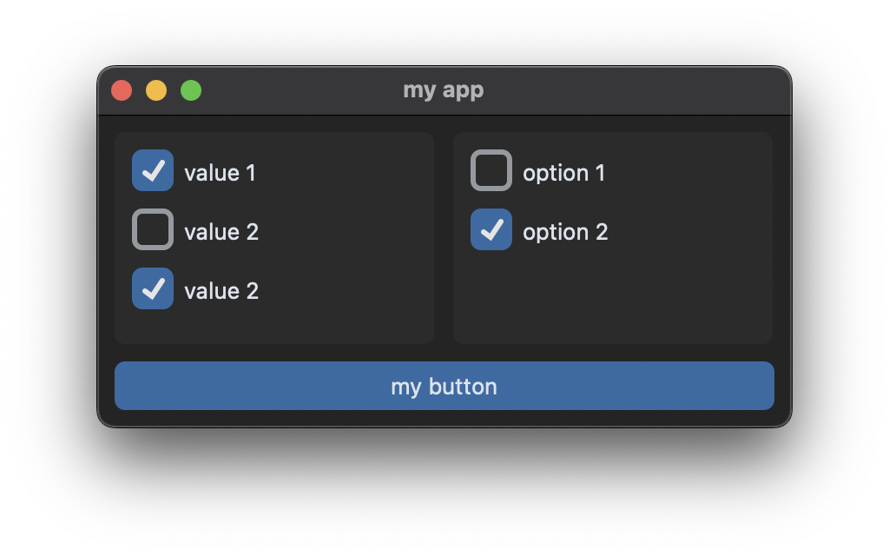
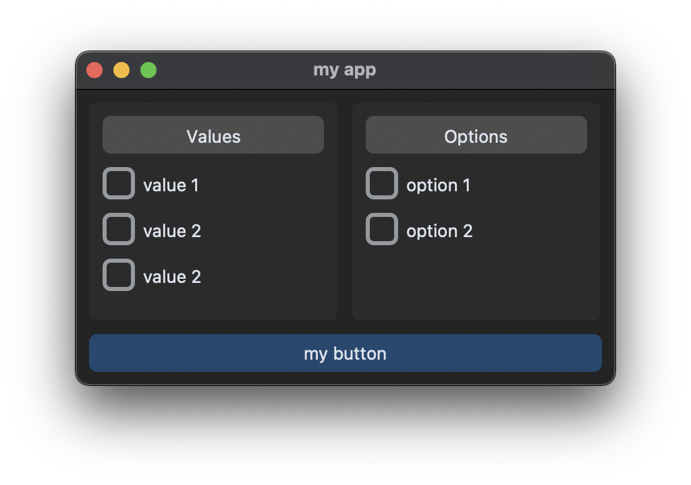
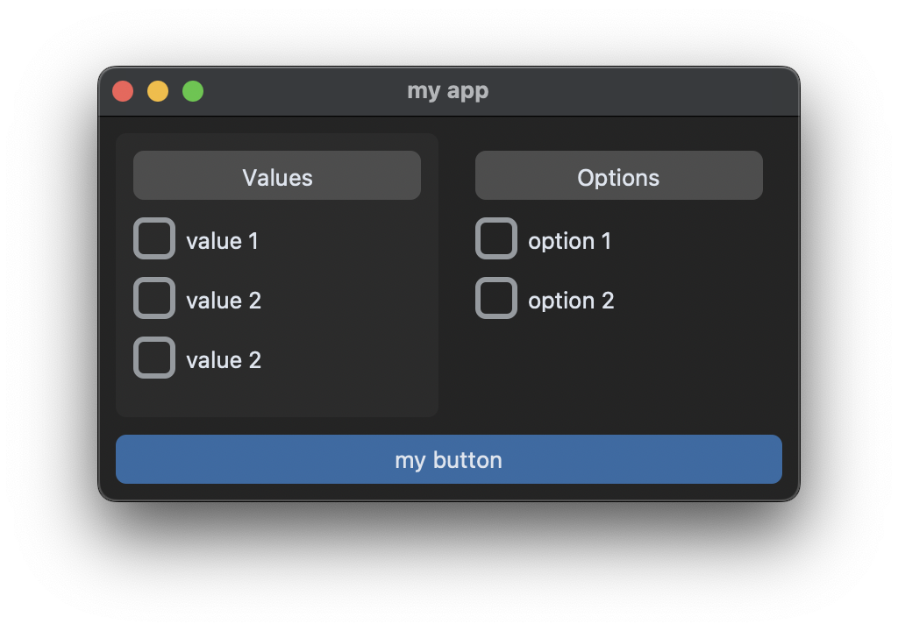
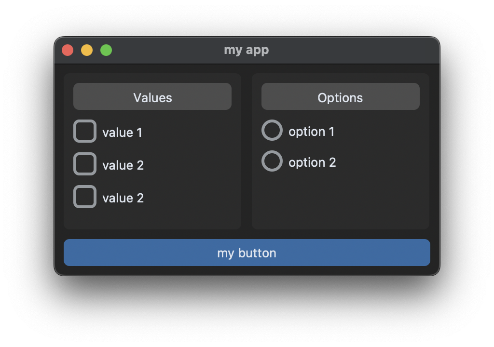

# Using Frames

## Criando um frame

Comece com o exemplo básico e insira checkboxes no layout:

```python
import customtkinter

class App(customtkinter.CTk):
    def __init__(self):
        super().__init__()

        self.title("my app")
        self.geometry("400x180")
        self.grid_columnconfigure(0, weight=1)
        self.grid_rowconfigure((0, 1), weight=1)

        self.checkbox_1 = customtkinter.CTkCheckBox(self, text="checkbox 1")
        self.checkbox_1.grid(row=0, column=0, padx=10, pady=(10, 0), sticky="w")

        self.checkbox_2 = customtkinter.CTkCheckBox(self, text="checkbox 2")
        self.checkbox_2.grid(row=1, column=0, padx=10, pady=(10, 0), sticky="w")

        self.button = customtkinter.CTkButton(self, text="my button", command=self.button_callback)
        self.button.grid(row=3, column=0, padx=10, pady=10, sticky="ew")

    def button_callback(self):
        print("button pressed")

app = App()
app.mainloop()
```



## Motivação para usar frames

Se você adicionar uma nova checkbox na linha 2, também precisará atualizar a linha do botão. Use `CTkFrame` para isolar mudanças:

```python
import customtkinter

class App(customtkinter.CTk):
    def __init__(self):
        super().__init__()

        self.title("my app")
        self.geometry("400x180")
        self.grid_columnconfigure(0, weight=1)
        self.grid_rowconfigure(0, weight=1)

        self.checkbox_frame = customtkinter.CTkFrame(self)
        self.checkbox_frame.grid(row=0, column=0, padx=10, pady=(10, 0), sticky="nsw")

        self.checkbox_1 = customtkinter.CTkCheckBox(self.checkbox_frame, text="checkbox 1")
        self.checkbox_1.grid(row=0, column=0, padx=10, pady=(10, 0), sticky="w")

        self.checkbox_2 = customtkinter.CTkCheckBox(self.checkbox_frame, text="checkbox 2")
        self.checkbox_2.grid(row=1, column=0, padx=10, pady=(10, 0), sticky="w")

        self.button = customtkinter.CTkButton(self, text="my button", command=self.button_callback)
        self.button.grid(row=1, column=0, padx=10, pady=10, sticky="ew")

    def button_callback(self):
        print("button pressed")

app = App()
app.mainloop()
```



## Usando classes para frames

Crie uma classe para o frame, herdando de `CTkFrame`:

```python
import customtkinter

class MyCheckboxFrame(customtkinter.CTkFrame):
    def __init__(self, master):
        super().__init__(master)

        self.checkbox_1 = customtkinter.CTkCheckBox(self, text="checkbox 1")
        self.checkbox_1.grid(row=0, column=0, padx=10, pady=(10, 0), sticky="w")

        self.checkbox_2 = customtkinter.CTkCheckBox(self, text="checkbox 2")
        self.checkbox_2.grid(row=1, column=0, padx=10, pady=(10, 0), sticky="w")


class App(customtkinter.CTk):
    def __init__(self):
        super().__init__()

        self.title("my app")
        self.geometry("400x180")
        self.grid_columnconfigure(0, weight=1)
        self.grid_rowconfigure(0, weight=1)

        self.checkbox_frame = MyCheckboxFrame(self)
        self.checkbox_frame.grid(row=0, column=0, padx=10, pady=(10, 0), sticky="nsw")

        self.button = customtkinter.CTkButton(self, text="my button", command=self.button_callback)
        self.button.grid(row=1, column=0, padx=10, pady=10, sticky="ew")

    def button_callback(self):
        print("button pressed")

app = App()
app.mainloop()
```



## Adicionar mais checkboxes

Agora você pode incluir mais checkboxes apenas na classe do frame:

```python
class MyCheckboxFrame(customtkinter.CTkFrame):
    def __init__(self, master):
        super().__init__(master)

        self.checkbox_1 = customtkinter.CTkCheckBox(self, text="checkbox 1")
        self.checkbox_1.grid(row=0, column=0, padx=10, pady=(10, 0), sticky="w")

        self.checkbox_2 = customtkinter.CTkCheckBox(self, text="checkbox 2")
        self.checkbox_2.grid(row=1, column=0, padx=10, pady=(10, 0), sticky="w")

        self.checkbox_3 = customtkinter.CTkCheckBox(self, text="checkbox 3")
        self.checkbox_3.grid(row=2, column=0, padx=10, pady=(10, 0), sticky="w")
```



## Expandiendo a classe de frame

Implemente `get()` para consultar o estado sem expor widgets:

```python
class MyCheckboxFrame(customtkinter.CTkFrame):
    def __init__(self, master):
        super().__init__(master)

        self.checkbox_1 = customtkinter.CTkCheckBox(self, text="checkbox 1")
        self.checkbox_1.grid(row=0, column=0, padx=10, pady=(10, 0), sticky="w")
        self.checkbox_2 = customtkinter.CTkCheckBox(self, text="checkbox 2")
        self.checkbox_2.grid(row=1, column=0, padx=10, pady=(10, 0), sticky="w")
        self.checkbox_3 = customtkinter.CTkCheckBox(self, text="checkbox 3")
        self.checkbox_3.grid(row=2, column=0, padx=10, pady=(10, 0), sticky="w")

    def get(self):
        checked_checkboxes = []
        if self.checkbox_1.get() == 1:
            checked_checkboxes.append(self.checkbox_1.cget("text"))
        if self.checkbox_2.get() == 1:
            checked_checkboxes.append(self.checkbox_2.cget("text"))
        if self.checkbox_3.get() == 1:
            checked_checkboxes.append(self.checkbox_3.cget("text"))
        return checked_checkboxes
```

```python
class App(customtkinter.CTk):
    def __init__(self):
        super().__init__()
        self.title("my app")
        self.geometry("400x180")
        self.grid_columnconfigure(0, weight=1)
        self.grid_rowconfigure(0, weight=1)

        self.checkbox_frame = MyCheckboxFrame(self)
        self.checkbox_frame.grid(row=0, column=0, padx=10, pady=(10, 0), sticky="nsew")

        self.button = customtkinter.CTkButton(self, text="my button", command=self.button_callback)
        self.button.grid(row=1, column=0, padx=10, pady=10, sticky="ew")

    def button_callback(self):
        print("checked checkboxes:", self.checkbox_frame.get())

app = App()
app.mainloop()
```

Output:

```text
checked checkboxes: ['checkbox 1', 'checkbox 3']
```

## Frame dinâmico

Receba a lista de valores para tornar o frame reutilizável:

```python
class MyCheckboxFrame(customtkinter.CTkFrame):
    def __init__(self, master, values):
        super().__init__(master)
        self.values = values
        self.checkboxes = []

        for i, value in enumerate(self.values):
            checkbox = customtkinter.CTkCheckBox(self, text=value)
            checkbox.grid(row=i, column=0, padx=10, pady=(10, 0), sticky="w")
            self.checkboxes.append(checkbox)

    def get(self):
        checked_checkboxes = []
        for checkbox in self.checkboxes:
            if checkbox.get() == 1:
                checked_checkboxes.append(checkbox.cget("text"))
        return checked_checkboxes
```

```python
class App(customtkinter.CTk):
    def __init__(self):
        super().__init__()
        self.title("my app")
        self.geometry("400x180")
        self.grid_columnconfigure((0, 1), weight=1)
        self.grid_rowconfigure(0, weight=1)

        self.checkbox_frame_1 = MyCheckboxFrame(self, values=["value 1", "value 2", "value 3"])
        self.checkbox_frame_1.grid(row=0, column=0, padx=10, pady=(10, 0), sticky="nsew")

        self.checkbox_frame_2 = MyCheckboxFrame(self, values=["option 1", "option 2"])
        self.checkbox_frame_2.grid(row=0, column=1, padx=(0, 10), pady=(10, 0), sticky="nsew")

        self.button = customtkinter.CTkButton(self, text="my button", command=self.button_callback)
        self.button.grid(row=3, column=0, padx=10, pady=10, sticky="ew", columnspan=2)

    def button_callback(self):
        print("checkbox_frame_1:", self.checkbox_frame_1.get())
        print("checkbox_frame_2:", self.checkbox_frame_2.get())

app = App()
app.mainloop()
```

```text
checkbox_frame_1: ['value 1', 'value 3']
checkbox_frame_2: ['option 2']
```



## Adicionando título ao frame

```python
class MyCheckboxFrame(customtkinter.CTkFrame):
    def __init__(self, master, title, values):
        super().__init__(master)
        self.grid_columnconfigure(0, weight=1)
        self.values = values
        self.title = title
        self.checkboxes = []

        self.title = customtkinter.CTkLabel(self, text=self.title, fg_color="gray30", corner_radius=6)
        self.title.grid(row=0, column=0, padx=10, pady=(10, 0), sticky="ew")

        for i, value in enumerate(self.values):
            checkbox = customtkinter.CTkCheckBox(self, text=value)
            checkbox.grid(row=i+1, column=0, padx=10, pady=(10, 0), sticky="w")
            self.checkboxes.append(checkbox)

    def get(self):
        checked_checkboxes = []
        for checkbox in self.checkboxes:
            if checkbox.get() == 1:
                checked_checkboxes.append(checkbox.cget("text"))
        return checked_checkboxes
```

```python
class App(customtkinter.CTk):
    def __init__(self):
        super().__init__()
        self.title("my app")
        self.geometry("400x220")
        self.grid_columnconfigure((0, 1), weight=1)
        self.grid_rowconfigure(0, weight=1)

        self.checkbox_frame_1 = MyCheckboxFrame(self, "Values", values=["value 1", "value 2", "value 3"])
        self.checkbox_frame_1.grid(row=0, column=0, padx=10, pady=(10, 0), sticky="nsew")

        self.checkbox_frame_2 = MyCheckboxFrame(self, "Options", values=["option 1", "option 2"])
        self.checkbox_frame_2.grid(row=0, column=1, padx=(0, 10), pady=(10, 0), sticky="nsew")

        self.button = customtkinter.CTkButton(self, text="my button", command=self.button_callback)
        self.button.grid(row=3, column=0, padx=10, pady=10, sticky="ew", columnspan=2)

    def button_callback(self):
        print("checkbox_frame:", self.checkbox_frame.get())

app = App()
app.mainloop()
```



Você pode deixar o frame transparente, já que `CTkFrame` herda de frame base:

```python
self.checkbox_frame_2.configure(fg_color="transparent")
```



## Frame de RadioButtons

`MyRadiobuttonFrame` funciona de forma análoga:

```python
class MyRadiobuttonFrame(customtkinter.CTkFrame):
    def __init__(self, master, title, values):
        super().__init__(master)
        self.grid_columnconfigure(0, weight=1)
        self.values = values
        self.title = title
        self.radiobuttons = []
        self.variable = customtkinter.StringVar(value="")

        self.title = customtkinter.CTkLabel(self, text=self.title, fg_color="gray30", corner_radius=6)
        self.title.grid(row=0, column=0, padx=10, pady=(10, 0), sticky="ew")

        for i, value in enumerate(self.values):
            radiobutton = customtkinter.CTkRadioButton(self, text=value, value=value, variable=self.variable)
            radiobutton.grid(row=i + 1, column=0, padx=10, pady=(10, 0), sticky="w")
            self.radiobuttons.append(radiobutton)

    def get(self):
        return self.variable.get()

    def set(self, value):
        self.variable.set(value)
```

```python
class App(customtkinter.CTk):
    def __init__(self):
        super().__init__()
        self.title("my app")
        self.geometry("400x220")
        self.grid_columnconfigure((0, 1), weight=1)
        self.grid_rowconfigure(0, weight=1)

        self.checkbox_frame = MyCheckboxFrame(self, "Values", values=["value 1", "value 2", "value 3"])
        self.checkbox_frame.grid(row=0, column=0, padx=10, pady=(10, 0), sticky="nsew")

        self.radiobutton_frame = MyRadiobuttonFrame(self, "Options", values=["option 1", "option 2"])
        self.radiobutton_frame.grid(row=0, column=1, padx=(0, 10), pady=(10, 0), sticky="nsew")

        self.button = customtkinter.CTkButton(self, text="my button", command=self.button_callback)
        self.button.grid(row=3, column=0, padx=10, pady=10, sticky="ew", columnspan=2)

    def button_callback(self):
        print("checkbox_frame:", self.checkbox_frame.get())
        print("radiobutton_frame:", self.radiobutton_frame.get())

app = App()
app.mainloop()
```


