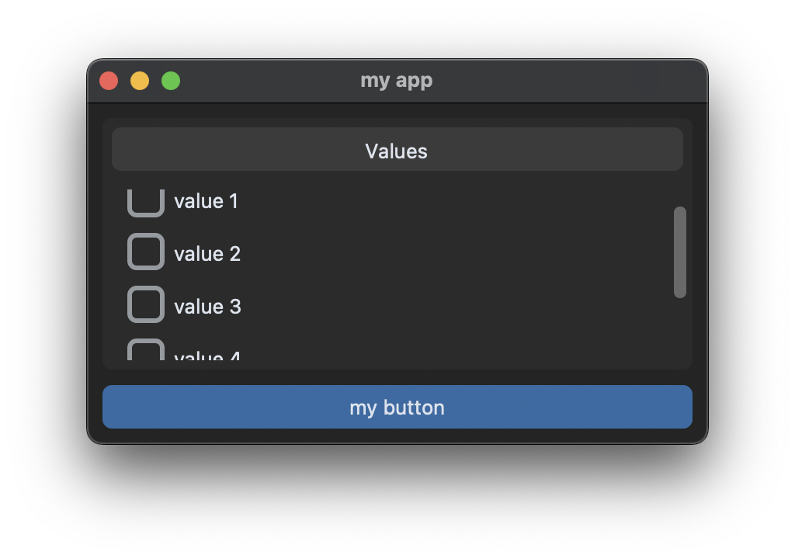

# Scrollable frames

## Frame de checkboxes

Reutilize a classe `MyCheckboxFrame` do tutorial anterior:

```python
import customtkinter

class MyScrollableCheckboxFrame(customtkinter.CTkScrollableFrame):
    def __init__(self, master, title, values):
        super().__init__(master, label_text=title)
        self.grid_columnconfigure(0, weight=1)
        self.values = values
        self.checkboxes = []

        for i, value in enumerate(self.values):
            checkbox = customtkinter.CTkCheckBox(self, text=value)
            checkbox.grid(row=i, column=0, padx=10, pady=(10, 0), sticky="w")
            self.checkboxes.append(checkbox)

    def get(self):
        checked_checkboxes = []
        for checkbox in self.checkboxes:
            if checkbox.get() == 1:
                checked_checkboxes.append(checkbox.cget("text"))
        return checked_checkboxes
```

O `CTkScrollableFrame` adiciona automaticamente uma scrollbar. O frame não cresce com o conteúdo dos widgets internos. Também há `label_text` para usar como título.

```python
import customtkinter

class App(customtkinter.CTk):
    def __init__(self):
        super().__init__()

        self.title("my app")
        self.geometry("400x220")
        self.grid_columnconfigure(0, weight=1)
        self.grid_rowconfigure(0, weight=1)

        values = ["value 1", "value 2", "value 3", "value 4", "value 5", "value 6"]
        self.scrollable_checkbox_frame = MyScrollableCheckboxFrame(self, title="Values", values=values)
        self.scrollable_checkbox_frame.grid(row=0, column=0, padx=10, pady=(10, 0), sticky="nsew")

        self.button = customtkinter.CTkButton(self, text="my button", command=self.button_callback)
        self.button.grid(row=3, column=0, padx=10, pady=10, sticky="ew", columnspan=2)

    def button_callback(self):
        print("checkbox_frame:", self.checkbox_frame.get())
        print("radiobutton_frame:", self.radiobutton_frame.get())

app = App()
app.mainloop()
```



> Mais exemplos: https://github.com/TomSchimansky/CustomTkinter/blob/master/examples/scrollable_frame_example.py
