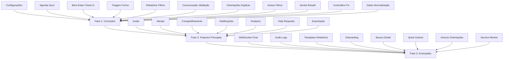

# Plano de Replicação: SerPleno Desktop Web → CustomTkinter

> Documento de planejamento detalhado para replicar e adaptar todas as funcionalidades
> da versão desktop web existente no projeto CustomTkinter.
> Gerado em modo autônomo após análise exaustiva de ambos os repositórios.

---

## 1. Resumo Executivo

### 1.1 Estado Atual

| Aspecto | Web Desktop | CustomTkinter Desktop |
|---------|-------------|----------------------|
| **Views/Seções** | 10 seções SPA | 10 views implementadas |
| **API Endpoints** | ~90+ endpoints | ~30+ endpoints consumidos |
| **Models** | 20+ models | 4 domain models |
| **Services** | 25+ services | 13 services |
| **Features Completas** | ~95% | ~65% |

### 1.2 Objetivo

Alcançar paridade funcional mínima de **90%** entre o desktop web e o CustomTkinter,
mantendo a arquitetura em camadas já estabelecida e a experiência de usuário polida.

---

## 2. Análise de Gaps

### 2.1 Gaps Críticos (Bloqueiam fluxos principais)

| # | Feature | Status Web | Status CTk | Impacto |
|---|---------|-----------|-----------|---------|
| 1 | **Metas e Objetivos (Goals)** | Completo | Ausente | Alto — fluxo de acompanhamento de estudantes |
| 2 | **Alertas Avançados** | Completo | Ausente | Alto — sinalização de risco |
| 3 | **Compartilhamento de Dados Clínicos** | Completo | Ausente | Alto — colaboração entre profissionais |
| 4 | **Notificações Sistemáticas** | Completo | Ausente | Médio — engajamento |
| 5 | **Analytics e Tendências** | Completo | Ausente | Médio — visão executiva |
| 6 | **Exportação Avançada** | Completo | Parcial | Médio — relatórios |
| 7 | **Help Requests (Integração SerPleno)** | Completo | Ausente | Alto — canal de crise |

### 2.2 Gaps Médios (Completam fluxos)

| # | Feature | Status Web | Status CTk | Impacto |
|---|---------|-----------|-----------|---------|
| 8 | **Check-in de Bem-estar (formulário)** | Completo | Ausente | Alto |
| 9 | **Triagem — seleção de formulário** | Completo | Ausente | Médio |
| 10 | **Orientações — duplicar** | Completo | Ausente | Baixo |
| 11 | **Relatórios — filtros e bulk ops** | Completo | Ausente | Médio |
| 12 | **WebSocket Chat** | Completo | Ausente | Médio |
| 13 | **Audit Logs** | Completo | Ausente | Baixo |
| 14 | **Templates de Relatórios** | Completo | Ausente | Baixo |

### 2.3 Gaps Baixos (Polimento)

| # | Feature | Status Web | Status CTk | Impacto |
|---|---------|-----------|-----------|---------|
| 15 | **Onboarding tour** | Completo | Ausente | Baixo |
| 16 | **Busca global** | Completo | Ausente | Baixo |
| 17 | **Quick actions** | Completo | Ausente | Baixo |
| 18 | **Anexos em orientações** | Completo | Ausente | Baixo |
| 19 | **Service Worker / Notificações** | Completo | Ausente | Baixo |

---

## 3. Fases de Implementação

### Fase 1: Correções e Completude dos Módulos Existentes
**Duração estimada:** 3-4 sprints  
**Objetivo:** Corrigir os 11 gaps listados em `fluxos-incompletos.md` e garantir que
as 10 views existentes estejam funcionais e completas.

#### Tarefas:

**1.1 Configurações — persistência backend**
- Conectar `configuracoes.py` (controller + service) à API do web desktop
- Implementar sync bidirecional (local ↔ API)
- Adicionar validação e tratamento de erros

**1.2 Agenda — sincronização automática**
- Implementar auto-reload da grade após edição de horários
- Adicionar indicador visual de sincronização
- Corrigir `listar_horarios_base()` síncrono → async

**1.3 Bem-Estar — formulário de check-in**
- Criar modal/view para novo check-in
- Implementar `api_create_wellness_checkin` no service
- Adicionar validação de campos

**1.4 Triagem — seleção de formulário**
- Implementar `listar_formularios()` na view
- Substituir campos hardcoded por formulários dinâmicos
- Adicionar preview do formulário selecionado

**1.5 Relatórios — filtros e exportação**
- Implementar filtros de data, tipo, formato
- Conectar exportação CSV/PDF à API real
- Adicionar preview antes de download

**1.6 Comunicação — validação de arquivo**
- Adicionar validação de tipo/tamanho de arquivo
- Implementar feedback visual de envio
- Adicionar retry em caso de falha

**1.7 Orientações — duplicar**
- Implementar lógica de duplicação
- Adicionar modal de confirmação
- Conectar à API `orientations/<id>/duplicate/`

**1.8 Avisos — filtros avançados**
- Implementar filtros por categoria/data/status
- Adicionar barra de status
- Melhorar exibição de erros

**1.9 Senha — reautenticação**
- Adicionar step de verificação adicional
- Implementar policy de senha forte

**1.10 Correção de controllers duplicados**
- Remover instanciação interna em `dashboard.py` e `estudantes.py`
- Usar apenas instância injetada

**1.11 Normalização de datas**
- Implementar parser `dd/mm/aaaa` → ISO
- Aplicar em todos os campos de data da triagem

---

### Fase 2: Features Principais Faltantes
**Duração estimada:** 4-5 sprints  
**Objetivo:** Implementar features de alto impacto que existem no web mas não no CTk.

#### Tarefas:

**2.1 Metas e Objetivos (Goals)**
- Criar view `metas.py` com lista de metas
- Implementar CRUD de metas (título, categoria, prioridade, prazo)
- Adicionar registro de progresso (porcentagem + notas)
- Implementar detecção de metas atrasadas
- Adicionar estatísticas de metas

**2.2 Alertas Avançados**
- Criar view `alertas.py`
- Implementar lista de alertas com filtros (tipo, severidade, data)
- Adicionar ações: marcar como lido, dispensar, marcar todos como lido
- Implementar badge de alertas não lidos
- Adicionar cache local (TTL 60s)

**2.3 Compartilhamento de Dados Clínicos**
- Criar view `compartilhamento.py`
- Implementar lista de dados compartilhados
- Adicionar ações: compartilhar, descompartilhar, bulk share/unshare
- Implementar histórico de compartilhamento por estudante
- Adicionar relatório de compartilhamento

**2.4 Notificações Sistemáticas**
- Implementar sistema de notificações no header
- Adicionar dropdown/painel de notificações
- Implementar marcação como lida (individual e bulk)
- Adicionar contador de não lidas
- Implementar cache de notificações

**2.5 Analytics e Tendências**
- Expandir dashboard com gráficos de tendência (matplotlib)
- Implementar view `analytics.py` ou expandir dashboard
- Adicionar métricas de performance
- Implementar busca global (students, appointments, screenings)
- Adicionar sugestões de quick actions

**2.6 Help Requests (Integração SerPleno)**
- Criar view `pedidos_ajuda.py`
- Implementar lista de pedidos de ajuda
- Adicionar ações: marcar visto, iniciar atendimento, resolver, responder
- Implementar filtros por status
- Adicionar notificação de novos pedidos

**2.7 Exportação Avançada**
- Expandir view `relatorio.py` com mais formatos
- Implementar exportação de estudantes, appointments, screenings, interventions
- Adicionar filtros de data e tipo
- Implementar bulk operations (download/delete)

---

### Fase 3: Features Avançadas e Polimento
**Duração estimada:** 3-4 sprints  
**Objetivo:** Implementar features avançadas e melhorias de UX/UI.

#### Tarefas:

**3.1 WebSocket Chat**
- Implementar consumer WebSocket no backend (se não existir)
- Adicionar view de chat em tempo real
- Implementar lista de contatos online
- Adicionar suporte a arquivos no chat
- Implementar cache de mensagens local

**3.2 Audit Logs**
- Criar view `audit_logs.py`
- Implementar lista de logs com filtros (usuário, ação, modelo, data)
- Adicionar estatísticas de auditoria
- Implementar exportação de logs

**3.3 Templates de Relatórios**
- Implementar CRUD de templates
- Adicionar uso de templates na geração de relatórios
- Implementar preview de template

**3.4 Onboarding Tour**
- Implementar tour guiado para primeira vez
- Adicionar steps para cada seção principal
- Implementar skip/replay

**3.5 Busca Global**
- Implementar barra de busca global no header
- Adicionar busca em students, appointments, screenings
- Implementar resultados agrupados por tipo
- Adicionar atalho de teclado (Ctrl+K)

**3.6 Quick Actions**
- Implementar sugestões contextuais no dashboard
- Adicionar ações rápidas baseadas em estado do sistema
- Implementar persistência de ações favoritas

**3.7 Anexos em Orientações**
- Implementar upload de anexos em orientações
- Adicionar preview de anexos
- Implementar download e exclusão de anexos

**3.8 Service Worker / Notificações Desktop**
- Implementar notificações nativas do sistema operacional
- Adicionar som de notificação configurável
- Implementar badge de não lidas na barra de tarefas

---

## 4. Dependências e Ordem de Execução

---

## 5. Critérios de Aceite

### Fase 1
- [ ] Todos os 11 gaps de `fluxos-incompletos.md` resolvidos
- [ ] 10 views testadas e funcionais
- [ ] Cobertura de testes ≥ 80%
- [ ] Sem erros de lint (ruff)
- [ ] Sem erros de tipo (mypy)

### Fase 2
- [ ] 7 novas views/features implementadas
- [ ] Integração com API web desktop funcionando
- [ ] Modo offline mantido (fallback SQLite)
- [ ] Cobertura de testes ≥ 85%
- [ ] Documentação atualizada

### Fase 3
- [ ] 8 features avançadas implementadas
- [ ] UX/UI polido (animações, transições, feedback)
- [ ] Onboarding funcional
- [ ] Cobertura de testes ≥ 90%
- [ ] Build executável testado

---

## 6. Riscos e Mitigações

| Risco | Probabilidade | Impacto | Mitigação |
|--------|--------------|---------|-----------|
| API web desktop instável | Média | Alto | Implementar retry logic + cache local |
| Performance com many widgets | Média | Médio | Manter widget batching + view caching |
| Complexidade de WebSocket | Baixa | Médio | Usar biblioteca `websockets` com fallback polling |
| Mudanças no schema web desktop | Média | Alto | Versionar API + adapter pattern |
| Tamanho do executável | Baixa | Baixo | Manter dependências mínimas |

---

## 7. Próximos Passos Imediatos

1. **Revisar e aprovar este plano** com o usuário
2. **Iniciar Fase 1, Tarefa 1.3** (Bem-Estar check-in) — gap de alta prioridade
3. **Paralelizar tarefas independentes** da Fase 1 via sub-agentes
4. **Manter documento vivo** — atualizar progresso semanalmente

---

*Documento gerado em 2026-08-13 pelo Consultor Sênior Orientado a Resultados.*
