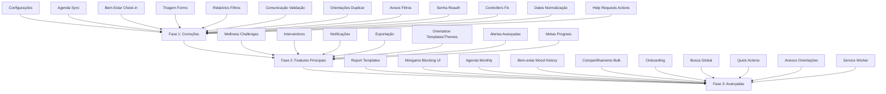

# Plano de Replicação: SerPleno Desktop Web → CustomTkinter

> Documento de planejamento detalhado para replicar e adaptar todas as funcionalidades
> da versão desktop web existente no projeto CustomTkinter.
> Atualizado em 2026-08-17 após análise exaustiva de ambos os repositórios.

---

## 1. Resumo Executivo

### 1.1 Estado Atual

| Aspecto | Web Desktop | CustomTkinter Desktop |
|---------|-------------|----------------------|
| **Views/Seções** | 10 seções SPA | 19 views registradas |
| **API Endpoints expostos** | 336 endpoints | ~45 endpoints consumidos |
| **Models Django** | 20+ models | Nenhum (usa dataclasses locais) |
| **Services/Features** | 25+ services | 13 features |
| **Features Completas** | ~95% | ~70% |

### 1.2 Objetivo

Alcançar paridade funcional de **100%** entre o desktop web e o CustomTkinter,
mantendo a arquitetura em camadas já estabelecida, modo offline (fallback SQLite)
e experiência de usuário polida.

---

## 2. Análise de Gaps Detalhada

### 2.1 Endpoints API Não Consumidos pelo Desktop

O desktop consome ~45 endpoints. O web expõe 336. Endpoints **não consumidos** agrupados por módulo:

| Módulo | Endpoints Não Consumidos | Status Desktop |
|--------|--------------------------|----------------|
| **Wellness Challenges** | 9 endpoints | ❌ NÃO CONSUMIDO |
| **Interventions** | 3 endpoints | ❌ NÃO CONSUMIDO |
| **Exports** | 4 endpoints | ❌ NÃO CONSUMIDO |
| **Minigame Blocking** | 4 endpoints (2 parcialmente) | ⚠️ PARCIAL |
| **Orientation Templates/Themes** | 4 endpoints | ❌ NÃO CONSUMIDO |
| **Report Templates & Bulk Ops** | 6 endpoints | ❌ NÃO CONSUMIDO |
| **Report Stats** | 2 endpoints | ❌ NÃO CONSUMIDO |
| **Notifications** | 3 endpoints | ❌ NÃO CONSUMIDO |
| **Help Requests** | 3 endpoints (2 ações) | ⚠️ PARCIAL |
| **Settings/Profile** | 2 endpoints | ❌ NÃO CONSUMIDO |

**Total:** ~50 endpoints não consumidos.

### 2.2 Views/Screens Ausentes no Desktop

| Feature Web | View Django | Status Desktop | Prioridade |
|-------------|-------------|----------------|------------|
| Wellness Challenges | `wellness_challenges.py` | ❌ AUSENTE | CRÍTICO |
| Interventions (dedicada) | `interventions.py` | ❌ AUSENTE | CRÍTICO |
| Notifications (nativa) | `notifications.py` | ❌ AUSENTE | ALTO |
| Orientation Templates | `orientations/templates/` | ❌ AUSENTE | MÉDIO |
| Orientation Themes | `orientations/themes/` | ❌ AUSENTE | MÉDIO |

### 2.3 Models/Entities Não Representados no Desktop

| Model Django | Desktop Equivalent | Status |
|--------------|---------------------|--------|
| `WellnessChallenge` | Nenhum | ❌ AUSENTE |
| `StudentWellnessChallenge` | Nenhum | ❌ AUSENTE |
| `OrientationTemplate` | Nenhum | ❌ AUSENTE |
| `OrientationTheme` | Nenhum | ❌ AUSENTE |
| `ReportTemplate` | Parcial (repo existe, sem view) | ⚠️ PARCIAL |
| `Intervention` | Parcial (tab em estudantes) | ⚠️ PARCIAL |
| `Notification` | Nenhum | ❌ AUSENTE |
| `MinigameBlockLog` | Repo existe, UI não expõe | ⚠️ PARCIAL |
| `UserProfile` (RBAC) | Nenhum | ❌ AUSENTE |
| `AuditLog` | View existe, serviços parciais | ⚠️ PARCIAL |

### 2.4 Funcionalidades Incompletas por Módulo

#### Metas/Goals
| Feature | Web | Desktop |
|---------|-----|---------|
| List/Create/Update/Delete goals | ✅ | ✅ |
| **Goal stats** | ✅ | ❌ |
| **Overdue goals** | ✅ | ❌ |
| **Record progress** | ✅ | ❌ |
| **Progress history** | ✅ | ❌ |

#### Bem-estar/Wellness
| Feature | Web | Desktop |
|---------|-----|---------|
| Dashboard | ✅ | ✅ |
| List/Create mood entries | ✅ | ✅ |
| **Student mood history** | ✅ | ❌ |
| **Mood averages** | ✅ | ❌ |
| List/Create checkins | ✅ | ✅ / ❌ UI |
| **Wellness challenges** | ✅ 9 endpoints | ❌ repo local apenas |

#### Relatórios
| Feature | Web | Desktop |
|---------|-----|---------|
| List/Generate/Get/Delete reports | ✅ | ✅ |
| Download PDF | ✅ | ✅ |
| **Download Excel/CSV/JSON** | ✅ | ❌ |
| **Report templates CRUD** | ✅ | ❌ |
| **Report stats/comparison** | ✅ | ❌ |
| **Bulk delete/download** | ✅ | ❌ |

#### Alertas
| Feature | Web | Desktop |
|---------|-----|---------|
| List alerts | ✅ | ✅ |
| **Critical alerts** | ✅ | ❌ |
| Mark as read | ✅ | ✅ |
| **Dismiss alert** | ✅ | ❌ |
| **Mark all read** | ✅ | ❌ |

#### Orientações
| Feature | Web | Desktop |
|---------|-----|---------|
| CRUD orientações | ✅ | ✅ |
| **Duplicate orientation** | ✅ | ❌ |
| **Templates** | ✅ | ❌ |
| **Themes** | ✅ | ❌ |
| **Attachment delete** | ✅ | ❌ |

#### Compartilhamento
| Feature | Web | Desktop |
|---------|-----|---------|
| List/Share/Unshare | ✅ | ✅ |
| **Bulk share/unshare** | ✅ | ❌ |
| **Student sharing history** | ✅ | ❌ |
| **Sharing report** | ✅ | ❌ |
| **Notifications** | ✅ | ❌ |

#### Agenda
| Feature | Web | Desktop |
|---------|-----|---------|
| CRUD appointments | ✅ | ✅ |
| **Monthly view** | ✅ | ❌ |
| Available times | ✅ | ✅ |
| **Manage times UI** | ✅ | ❌ |

#### Comunicação
| Feature | Web | Desktop |
|---------|-----|---------|
| Messages/Contacts | ✅ | ✅ |
| **File validation** | ✅ | ❌ |
| **Send feedback** | ✅ | ❌ |

#### Configurações
| Feature | Web | Desktop |
|---------|-----|---------|
| Persist settings | ✅ | ❌ local JSON |
| Sync with API | ✅ | ❌ |
| Update profile | ✅ | ❌ |

---

## 3. Fases de Implementação

### Fase 1: Correções e Completude dos Módulos Existentes
**Objetivo:** Corrigir os gaps listados em `fluxos-incompletos.md` e garantir que
todas as views existentes estejam funcionais e completas.

#### Tarefas:

**1.1 Configurações — persistência backend**
- Conectar `configuracoes.py` (controller + service) à API `/settings/` e `/profile/update/`
- Implementar sync bidirecional (local ↔ API)
- Adicionar validação e tratamento de erros

**1.2 Agenda — sincronização automática**
- Implementar auto-reload da grade após edição de horários
- Adicionar indicador visual de sincronização
- Corrigir `listar_horarios_base()` síncrono → async

**1.3 Bem-Estar — formulário de check-in**
- Criar modal/view para novo check-in
- Implementar `api_create_wellness_checkin` no service
- Adicionar validação de campos

**1.4 Triagem — seleção de formulário**
- Implementar `listar_formularios()` na view
- Substituir campos hardcoded por formulários dinâmicos
- Adicionar preview do formulário selecionado

**1.5 Relatórios — filtros e exportação**
- Implementar filtros de data, tipo, formato
- Conectar exportação CSV/Excel/JSON à API real
- Adicionar preview antes de download

**1.6 Comunicação — validação de arquivo**
- Adicionar validação de tipo/tamanho de arquivo
- Implementar feedback visual de envio
- Adicionar retry em caso de falha

**1.7 Orientações — duplicar**
- Implementar lógica de duplicação
- Adicionar modal de confirmação
- Conectar à API `orientations/<id>/duplicate/`

**1.8 Avisos — filtros avançados**
- Implementar filtros por categoria/data/status
- Adicionar barra de status
- Melhorar exibição de erros

**1.9 Senha — reautenticação**
- Adicionar step de verificação adicional
- Implementar policy de senha forte

**1.10 Correção de controllers duplicados**
- Remover instanciação interna em `dashboard.py` e `estudantes.py`
- Usar apenas instância injetada

**1.11 Normalização de datas**
- Implementar parser `dd/mm/aaaa` → ISO
- Aplicar em todos os campos de data da triagem

**1.12 Help Requests — ações completas**
- Implementar actions `update` e `respond` na UI
- Conectar a `/help-requests/<id>/update/` e `/help-requests/<id>/respond/`

---

### Fase 2: Features Principais Faltantes
**Objetivo:** Implementar features de alto impacto que existem no web mas não no CTk.

#### Tarefas:

**2.1 Wellness Challenges**
- Criar view `wellness_challenges.py`
- Implementar CRUD de challenges
- Implementar assign/unassign/complete por estudante
- Adicionar dashboard de challenges
- Conectar a todos os 9 endpoints da API

**2.2 Interventions (feature dedicada)**
- Expandir tab em `estudantes.py` para view dedicada `interventions.py`
- Implementar CRUD de intervenções
- Adicionar filtros por estudante/data/tipo
- Conectar a `/interventions/`, `/interventions/add/`, `/interventions/<id>/delete/`

**2.3 Notificações Nativas**
- Implementar sistema de notificações no header
- Adicionar dropdown/painel de notificações
- Implementar marcação como lida (individual e bulk)
- Adicionar contador de não lidas
- Conectar a `/notifications/`, `/notifications/<id>/read/`, `/notifications/read-all/`

**2.4 Exportação Avançada**
- Expandir view `relatorio.py` com mais formatos
- Implementar exportação de estudantes, appointments, screenings, interventions
- Adicionar filtros de data e tipo
- Conectar a `/export/students/`, `/export/appointments/`, `/export/screenings/`, `/export/interventions/`

**2.5 Orientation Templates & Themes**
- Implementar CRUD de templates
- Implementar CRUD de themes
- Adicionar uso de templates na criação de orientações
- Conectar a `/orientations/templates/`, `/orientations/templates/use/`, `/orientations/themes/`

**2.6 Alertas Avançadas**
- Completar ações: dismiss, mark-all-read, critical alerts
- Conectar a `/alerts/critical/`, `/alerts/<id>/dismiss/`, `/alerts/read-all/`

**2.7 Metas — Progresso e Estatísticas**
- Implementar registro de progresso (porcentagem + notas)
- Implementar detecção de metas atrasadas
- Adicionar estatísticas de metas
- Conectar a `/goals/stats/`, `/goals/overdue/`, `/goals/<id>/progress/`

---

### Fase 3: Features Avançadas e Polimento
**Objetivo:** Implementar features avançadas e melhorias de UX/UI para atingir 100%.

#### Tarefas:

**3.1 Report Templates & Bulk Operations**
- Implementar CRUD de templates na view `report_template.py`
- Implementar bulk delete/download de relatórios
- Adicionar stats e comparison de relatórios
- Conectar a `/reports/templates/*`, `/reports/bulk/*`, `/reports/stats/*`

**3.2 Minigame Blocking — UI completa**
- Adicionar aba/mini-view para histórico de bloqueios
- Implementar `check-suspicious-behavior` e `block-log`
- Conectar a `/students/<id>/check-suspicious-behavior/` e `/students/<id>/block-log/`

**3.3 Agenda — Monthly View**
- Implementar visualização mensal da agenda
- Adicionar navegação entre meses
- Conectar a `/schedule/month/`

**3.4 Bem-estar — Student Mood History & Averages**
- Adicionar view de histórico de humor por estudante
- Implementar médias de humor
- Conectar a `/wellness/mood/student/<id>/` e `/wellness/mood/student/<id>/history/` e `/wellness/mood/averages/`

**3.5 Compartilhamento — Bulk e Histórico**
- Implementar bulk share/unshare na UI
- Adicionar visualização de histórico por estudante
- Adicionar relatório de compartilhamento
- Conectar a `/shared-data/bulk/*`, `/shared-data/history/<id>/`, `/shared-data/report/`

**3.6 Onboarding Tour**
- Implementar tour guiado para primeira vez
- Adicionar steps para cada seção principal
- Implementar skip/replay

**3.7 Busca Global**
- Implementar barra de busca global no header
- Adicionar busca em students, appointments, screenings
- Implementar resultados agrupados por tipo
- Adicionar atalho de teclado (Ctrl+K)

**3.8 Quick Actions**
- Implementar sugestões contextuais no dashboard
- Adicionar ações rápidas baseadas em estado do sistema
- Implementar persistência de ações favoritas

**3.9 Anexos em Orientações**
- Implementar upload de anexos em orientações
- Adicionar preview de anexos
- Implementar download e exclusão de anexos
- Conectar a `/orientations/attachments/<id>/delete/`

**3.10 Service Worker / Notificações Desktop**
- Implementar notificações nativas do sistema operacional
- Adicionar som de notificação configurável
- Implementar badge de não lidas na barra de tarefas

---

## 4. Dependências e Ordem de Execução



---

## 5. Critérios de Aceite

### Fase 1
- [ ] Todos os 12 gaps de `fluxos-incompletos.md` resolvidos
- [ ] 19 views testadas e funcionais
- [ ] Cobertura de testes ≥ 80%
- [ ] Sem erros de lint (ruff)
- [ ] Sem erros de tipo (mypy)

### Fase 2
- [ ] 7 novas views/features implementadas
- [ ] Integração com API web desktop funcionando
- [ ] Modo offline mantido (fallback SQLite)
- [ ] Cobertura de testes ≥ 85%
- [ ] Documentação atualizada

### Fase 3
- [ ] 10 features avançadas implementadas
- [ ] 100% paridade funcional com web desktop
- [ ] UX/UI polido (animações, transições, feedback)
- [ ] Onboarding funcional
- [ ] Cobertura de testes ≥ 90%
- [ ] Build executável testado

---

## 6. Riscos e Mitigações

| Risco | Probabilidade | Impacto | Mitigação |
|--------|--------------|---------|-----------|
| API web desktop instável | Média | Alto | Implementar retry logic + cache local |
| Performance com many widgets | Média | Médio | Manter widget batching + view caching |
| Complexidade de novas features | Baixa | Médio | Implementar incrementalmente com sub-agentes |
| Mudanças no schema web desktop | Média | Alto | Versionar API + adapter pattern |
| Tamanho do executável | Baixa | Baixo | Manter dependências mínimas |

---

## 7. Backlog Executivo

### Sprint 1 (Semana 1)
- [ ] **Configurações** — persistência backend (1.1)
- [ ] **Bem-Estar check-in** — modal/formulário (1.3)
- [ ] **Orientações duplicar** — implementar ação (1.7)
- [ ] **Controllers fix** — remover duplicações (1.10)

### Sprint 2 (Semana 2)
- [ ] **Agenda sync** — auto-reload + async (1.2)
- [ ] **Triagem forms** — seleção dinâmica (1.4)
- [ ] **Datas normalização** — parser dd/mm/aaaa (1.11)
- [ ] **Help Requests actions** — update/respond (1.12)

### Sprint 3 (Semana 3)
- [ ] **Relatórios filtros** — data/tipo/formato (1.5)
- [ ] **Comunicação validação** — arquivos (1.6)
- [ ] **Avisos filtros** — categoria/data/status (1.8)
- [ ] **Senha reauth** — step adicional (1.9)

### Sprint 4 (Semana 4)
- [ ] **Wellness Challenges** — feature completa (2.1)
- [ ] **Interventions** — view dedicada (2.2)
- [ ] **Notificações** — sistema nativo (2.3)

### Sprint 5 (Semana 5)
- [ ] **Exportação** — múltiplos formatos (2.4)
- [ ] **Orientation Templates/Themes** — CRUD (2.5)
- [ ] **Alertas avançadas** — dismiss/mark-all (2.6)

### Sprint 6 (Semana 6)
- [ ] **Metas progresso** — stats e overdue (2.7)
- [ ] **Report Templates** — CRUD + bulk ops (3.1)
- [ ] **Minigame Blocking UI** — histórico (3.2)

### Sprint 7 (Semana 7)
- [ ] **Agenda Monthly View** — navegação mensal (3.3)
- [ ] **Bem-estar Mood History** — históricos e médias (3.4)
- [ ] **Compartilhamento Bulk** — share/unshare massivo (3.5)

### Sprint 8 (Semana 8)
- [ ] **Onboarding Tour** — tour guiado (3.6)
- [ ] **Busca Global** — Ctrl+K (3.7)
- [ ] **Quick Actions** — sugestões contextuais (3.8)

### Sprint 9 (Semana 9)
- [ ] **Anexos Orientações** — upload/preview (3.9)
- [ ] **Service Worker** — notificações desktop (3.10)
- [ ] **Polimento geral** — animações, transições

### Sprint 10 (Semana 10)
- [ ] **Testes integrados** — cobertura ≥ 90%
- [ ] **Build executável** — teste em máquina limpa
- [ ] **Documentação final** — atualizar README e guides

---

## 8. Próximos Passos Imediatos

1. ✅ **Análise concluída** — gaps mapeados e documentados
2. **Iniciar Fase 1, Sprint 1** — Configurações, Bem-Estar check-in, Orientações duplicar
3. **Paralelizar tarefas independentes** via sub-agentes
4. **Manter documento vivo** — atualizar progresso a cada sprint

---

## 9. Análise Técnica Detalhada

### 9.1 Comparação de Views

| View Web | View Desktop CTk | Arquivo Web | Arquivo CTk | Status |
|----------|------------------|-------------|-------------|--------|
| Dashboard | DashboardFrame | `views/dashboard.py` | `ui/views/dashboard.py` | ✅ |
| Estudantes | EstudantesFrame | `views/students.py` | `ui/views/estudantes.py` | ✅ |
| Agenda | AgendaFrame | `views/schedule.py` | `ui/views/agenda.py` | ✅ |
| Bem-estar | BemEstarFrame | `views/wellness.py` | `ui/views/bem_estar.py` | ✅ |
| Triagem | TriagemFrame | `views/screening.py` | `ui/views/triagem.py` | ✅ |
| Relatórios | RelatorioFrame | `views/reports.py` | `ui/views/relatorio.py` | ✅ |
| Comunicação | ComunicacaoFrame | `views/communication.py` | `ui/views/comunicacao.py` | ✅ |
| Orientações | OrientacoesFrame | `views/orientations.py` | `ui/views/orientacoes.py` | ✅ |
| Avisos | AvisosFrame | `views/board.py` (implícito) | `ui/views/avisos.py` | ✅ |
| Configurações | ConfiguracoesFrame | `views/settings_api.py` | `ui/views/configuracoes.py` | ✅ |
| Metas | MetasFrame | `views/goals.py` | `ui/views/metas.py` | ✅ |
| Alertas | AlertasFrame | `views/alerts.py` | `ui/views/alertas.py` | ✅ |
| Analytics | AnalyticsFrame | `views/analytics.py` | `ui/views/analytics.py` | ✅ |
| Audit Logs | AuditLogsFrame | (não exposto) | `ui/views/audit_logs.py` | ✅ |
| Compartilhamento | CompartilhamentoDadosFrame | `views/shared_data_views.py` | `ui/views/compartilhamento.py` | ✅ |
| Pedidos de Ajuda | PedidosAjudaFrame | `views/integration.py` | `ui/views/pedidos_ajuda.py` | ✅ |
| Login | LoginFrame | `views/auth_views.py` | `ui/views/login.py` | ✅ |
| Report Templates | ReportTemplateFrame | (não exposto) | `ui/views/report_template.py` | ✅ |
| Notificações | NotificacoesFrame | `views/notifications.py` | `ui/views/notificacoes.py` | ❌ view sem controller/serviço |
| Wellness Challenges | — | `views/wellness_challenges.py` | **AUSENTE** | ❌ |
| Interventions | — | `views/interventions.py` | **AUSENTE** | ❌ |

### 9.2 Comparação de Endpoints

| Categoria | Endpoints Web | Endpoints Desktop | Cobertura |
|-----------|---------------|-------------------|-----------|
| Autenticação | 7 | 3 | 43% |
| Estudantes | 4 | 4 | 100% |
| Agenda | 4 | 4 | 100% |
| Horários | 2 | 2 | 100% |
| Triagem | 4 | 4 | 100% |
| Relatórios | 16 | 3 | 19% |
| Alertas | 5 | 3 | 60% |
| Orientações | 9 | 5 | 56% |
| Compartilhamento | 7 | 6 | 86% |
| Notificações | 3 | 0 | 0% |
| Metas | 6 | 5 | 83% |
| Bem-estar | 9 | 4 | 44% |
| Wellness Challenges | 9 | 0 | 0% |
| Analytics | 5 | 5 | 100% |
| Exportação | 4 | 0 | 0% |
| Intervenções | 3 | 0 | 0% |
| Help Requests | 3 | 1 | 33% |
| Settings/Profile | 2 | 0 | 0% |
| Users/Roles | 6 | 0 | 0% |
| Audit Logs | 2 | 2 | 100% |
| SerPleno Integration | 5 | 3 | 60% |
| Minigame Blocking | 4 | 2 | 50% |

**Cobertura global:** ~45 de 336 endpoints = **13%**

### 9.3 Arquitetura Desktop

O desktop possui arquitetura em camadas com fallback local:

```
src/ser_pleno/
├── app.py                          # Entry point
├── config/                         # Configurações
├── domain/models/                  # Dataclasses locais
├── features/                       # Features (repo + service)
│   ├── agenda/
│   ├── alertas/
│   ├── analytics/
│   ├── audit_logs/
│   ├── bem_estar/
│   ├── compartilhamento/
│   ├── comunicacao/
│   ├── configuracoes/
│   ├── dashboard/
│   ├── estudantes/
│   ├── metas/
│   ├── notificacoes/
│   ├── orientacoes/
│   ├── pedidos_ajuda/
│   ├── relatorio/
│   ├── report_template/
│   └── triagem/
├── infrastructure/
│   ├── api/                        # ClienteAPI + sync
│   ├── db/                         # Query helpers
│   ├── desktop/                    # Native notifier
│   └── local/                      # Local cache
├── repositories/                   # Base repositories
├── ui/                             # CustomTkinter UI
│   ├── components/
│   ├── navigation.py
│   ├── theme/
│   ├── views/
│   └── view_factory.py
└── utils/                          # Utilities
```

Cada feature segue o padrão:
```
features/<feature>/
├── repo.py      # Data access (API + local fallback)
└── service.py   # Business logic
```

---

## 10. Glossário

| Termo | Significado |
|-------|-------------|
| Web Desktop | Versão Django + JS do SerPleno |
| CTk / Desktop | Versão CustomTkinter executável |
| Feature | Módulo de negócio (ex: metas, alertas) |
| View | Tela CustomTkinter |
| Controller | Lógica de apresentação (web) |
| Service | Lógica de negócio (desktop) |
| Repo | Acesso a dados (desktop) |
| Fallback | Modo offline com SQLite local |

---

*Documento gerado em 2026-08-17 pelo Consultor Sênior Orientado a Resultados.*
